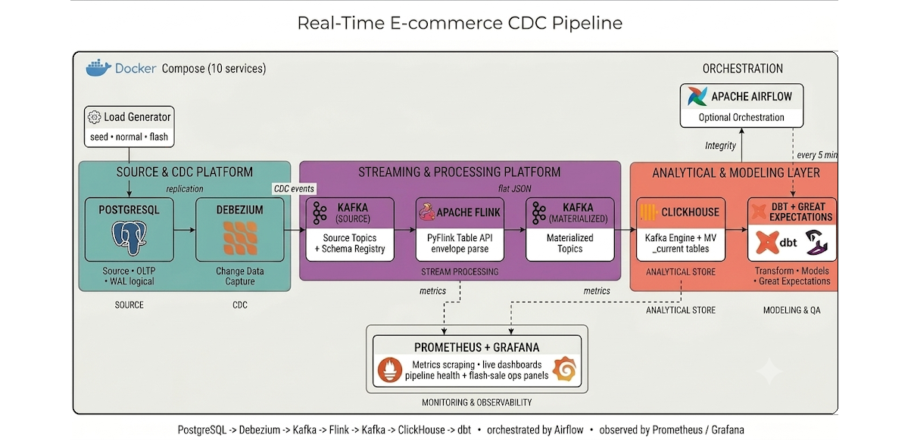

# 🔄 Real-time E-commerce CDC Pipeline


---

## 📌 Project Overview

This project is a **production-grade, log-based Change Data Capture (CDC) pipeline** for an **e-commerce domain**. It captures every row-level change in an operational PostgreSQL database — inserts, updates, **and deletes** — and streams them into a real-time analytical store in seconds, not hours.

The goal is to solve the three failure modes that quietly break scheduled batch ETL: deletes that never propagate, intermediate state that's lost between runs, and dashboards that are always a batch-interval stale. Every claim in this README is a **measured number**, not an estimate, and the entire ten-service stack starts from a single command.

👉 Think of it as a **real-world streaming analytics backend** built on the modern data engineering stack.

---

## 🏗️ Architecture



**Pipeline Flow:**

1. **Load Generator** → simulates realistic e-commerce traffic (`seed`, `normal`, `flash_sale`) directly into PostgreSQL.
2. **Debezium + Kafka** → reads the Postgres write-ahead log and streams every change as a CDC event.
3. **Apache Flink (PyFlink)** → parses the Debezium envelope and materialises flat records to Kafka topics.
4. **ClickHouse** → Kafka Engine + Materialized Views land the stream into queryable `*_current` tables.
5. **dbt + Great Expectations** → staging/gold models and row-count reconciliation between Postgres and ClickHouse.
6. **Prometheus + Grafana** → live pipeline-health and flash-sale operations dashboards.
7. **Airflow** → orchestrates the transformation layer on a 5-minute schedule (optional profile).

---

## ⚡ Tech Stack

- **PostgreSQL 15** → Source OLTP system with logical replication enabled
- **Debezium 2.4** → Log-based Change Data Capture from the Postgres WAL
- **Apache Kafka + Zookeeper 7.5.0** → Event transport for source and materialized topics
- **Confluent Schema Registry 7.5.0** → Schema compatibility enforcement
- **Apache Flink 1.18 (PyFlink)** → Stream processing and CDC envelope parsing
- **ClickHouse 23.11** → Real-time analytical store (Kafka Engine + Materialized Views)
- **dbt 1.8.0** → Staging & gold models, tests, SCD-style history
- **Great Expectations 0.18** → End-to-end data integrity checks
- **Prometheus 2.48 + Grafana 10.2** → Metrics scraping & live dashboards
- **Apache Airflow 2.9.3** → Orchestration & DAG scheduling (optional profile)
- **Docker & Docker Compose v2** → Ten-service containerized setup
- **Python 3.11 (Faker)** → Traffic simulation and benchmarking

---

## ✅ Key Features

- **Log-based CDC** capturing inserts, updates, and **deletes** (as explicit tombstone events) from the Postgres WAL
- **Simulated e-commerce system**: customers, products, orders, and order items with realistic constraints
- **Delete-aware analytics** — cancelled orders are removed downstream, something batch snapshots structurally miss
- **Intermediate-state metrics** — measures time-in-status transitions that only CDC can capture
- **Dead-Letter Queue** with type-based routing, Slack escalation, and an ordered `replay` tool
- **Failure-injection tested** — connector crash, broker outage, and controlled outage, each proven with zero data loss
- **Data quality gates** via dbt tests and Postgres↔ClickHouse row-count reconciliation
- **Automated orchestration** with Airflow and one-command startup

---

## 📊 Benchmark Results

All numbers are **measured** on the reference environment (Ubuntu Linux, Docker Engine, Compose v2) and written to `benchmarks/` as JSON.

**End-to-end latency** (Postgres `COMMIT` → row queryable in ClickHouse):

| Path | p50 | p95 | p99 |
|---|---|---|---|
| Postgres → Kafka | 490 ms | 936 ms | 1,047 ms |
| Postgres → ClickHouse (normal, 10 TPS) | 6,216 ms | 8,030 ms | — |
| Postgres → ClickHouse (flash sale, 50 TPS) | 7,522 ms | 8,162 ms | — |

**Reliability** (row counts reconciled after live failure injection):

| Test | Scenario | Recovery | Data loss |
|---|---|---|---|
| Debezium restart | Connector process crash | 56.1 s | 0 events |
| Kafka restart | Broker outage, auto-reconnect | 73.5 s | 0 events |
| Controlled outage | Operator pause / resume | immediate | 0 events |

**Analytical finding:** order confirmation runs roughly **9.2× slower under flash-sale load** — a bottleneck invisible to batch analytics, computable only because CDC preserves every intermediate status transition.

---

## 📂 Repository Structure

```
realtime-cdc-pipeline/
├── database/                 # Postgres schema + multi-mode load generator
│   ├── init.sql
│   └── load_generator.py
├── debezium/                 # CDC connector config, setup script, notes
│   ├── connector_config.json
│   ├── connector_setup.sh
│   └── CONNECTOR_NOTES.md
├── flink/                    # PyFlink jobs + custom image
│   ├── Dockerfile
│   ├── cdc_materialisation.py
│   └── order_metrics.py
├── clickhouse/               # Analytical schema, Kafka engines, MVs
│   └── schema.sql
├── dbt/                      # Staging + gold models, tests, sources
│   └── models/{staging,gold}/
├── great_expectations/       # End-to-end integrity checkpoint
│   └── run_checkpoint.py
├── dlq/                      # Dead-letter queue consumer + replay
│   └── dlq_consumer.py
├── monitoring/               # Prometheus config + Grafana dashboards
│   └── grafana/
├── analysis/                 # Flash-sale analytical report
│   └── flash_sale_analysis.py
├── benchmarks/               # Latency benchmarks + result printer
├── tests/                    # Failure-injection + schema-evolution tests
├── airflow/dags/             # 5-minute orchestration DAG (optional)
├── scripts/                  # Automation helpers (load, topics, health)
├── docker-compose.yml
├── start.sh                  # One-command cold start
├── stop.sh                   # Stop (preserve or wipe volumes)
├── requirements.txt
├── .env.example
├── DECISIONS.md              # Architecture decision records
└── future_work.md            # Scoped next steps
```

---

## ⚙️ Step-by-Step Implementation

### 1. Source Database & Load Generation
PostgreSQL 15 with `wal_level=logical` and a four-table e-commerce schema. A Python load generator drives three traffic modes — `seed`, `normal` (10 TPS), and `flash_sale` (50 TPS, with cancellations producing real deletes).

### 2. Change Data Capture
Debezium reads the Postgres WAL and publishes ordered CDC events to Kafka. Deletes emit tombstones so downstream consumers can remove rows. Schema Registry enforces compatibility on schema evolution.

### 3. Stream Processing
A PyFlink Table API job parses the Debezium JSON envelope (`before`/`after`/`op`/`ts_ms`), flattens records, marks deletes with `is_deleted`, and writes to materialized Kafka topics.

### 4. Analytical Store
ClickHouse consumes the materialized topics via Kafka Engine tables and Materialized Views, landing data into `orders_current`, `products_current`, and `customers_current` (ReplacingMergeTree) plus per-minute metrics.

### 5. Transformations & Data Quality
dbt builds staging and gold models (including the flash-sale slowdown mart), and Great Expectations reconciles Postgres↔ClickHouse row counts over a rolling 24-hour window with explicit UTC casting.

### 6. Reliability & Observability
A dead-letter queue routes failed events by type and supports ordered replay. Failure-injection tests prove zero data loss. Prometheus scrapes Flink and ClickHouse metrics into live Grafana dashboards.

---

## 🚀 Getting Started

### Prerequisites
- **Docker Engine** with the **Compose v2** plugin
- **Python 3.11** (virtual environment recommended)
- ~8 GB free RAM (ten services)

### Quick Start
```bash
git clone https://github.com/darkxaze/realtime-cdc-pipeline.git
cd realtime-cdc-pipeline

cp .env.example .env

# Cold start: builds the Flink image, starts all services, registers the
# Debezium connector, seeds Postgres, submits the Flink job, runs dbt,
# and passes the integrity checkpoint — end to end.
./start.sh
```

Once startup completes (~8 minutes):

| Service | URL |
|---|---|
| Flink Web UI | http://localhost:8082 |
| Grafana (`admin` / `admin`) | http://localhost:3001 |
| Prometheus | http://localhost:9090 |
| Kafka Connect REST API | http://localhost:8083 |
| ClickHouse HTTP | http://localhost:8123 |
| Airflow (optional profile) | http://localhost:8085 |

### Stopping & Resuming
```bash
./stop.sh                          # stop, preserve volumes
./start.sh --no-seed --no-build    # fast resume from existing state
./stop.sh --clean                  # stop and wipe all volumes (full reset)
```

---

## 🧪 Usage

```bash
# Traffic
./scripts/run_load.sh normal        # steady 10 TPS baseline
./scripts/run_load.sh flash_sale    # 50 TPS burst, re-runs dbt + prints analysis
./scripts/run_load.sh benchmark     # full latency suite → JSON + summary table

# Inspect results
python great_expectations/run_checkpoint.py   # Postgres↔ClickHouse parity
python analysis/flash_sale_analysis.py        # core analytical finding
python benchmarks/print_results.py            # benchmark summary

# Failure & schema tests
python tests/test_failure_recovery.py --test 1   # Debezium restart
python tests/test_failure_recovery.py --test 2   # Kafka restart
python tests/test_failure_recovery.py --test 3   # controlled outage
python tests/test_schema_evolution.py            # Schema Registry compatibility
```

---

## 📐 Engineering Decisions

Every non-obvious choice is documented as an ADR in [`DECISIONS.md`](DECISIONS.md), with options, rationale, and consequences. Highlights:

- **Kafka intermediary over a direct ClickHouse sink** — Flink ships no ClickHouse JDBC dialect; routing through Kafka reuses the connector and lets ClickHouse consume at its own pace.
- **Named-column JSON parsing** after the built-in `debezium-json` format silently dropped every record on the wrapped `{schema, payload}` envelope.
- **ReplacingMergeTree with `FINAL`** for CDC upserts, with the query-time latency cost measured.
- **`decimal.handling.mode=double`** to avoid a Flink 1.18 `ClassCastException` on Avro decimal types.
- **`delete+insert` incremental strategy in dbt** — the only viable approach given ClickHouse has no in-place `UPDATE`.

---

## 🔮 Future Work

Deliberately scoped to the streaming and analytics layer. The natural extension is an ML layer — fraud detection or demand forecasting — built on CDC-derived features that batch pipelines cannot produce. Concrete next steps (flash-sale latency tuning, event-time windowing, incremental hourly revenue) are in [`future_work.md`](future_work.md).

---
